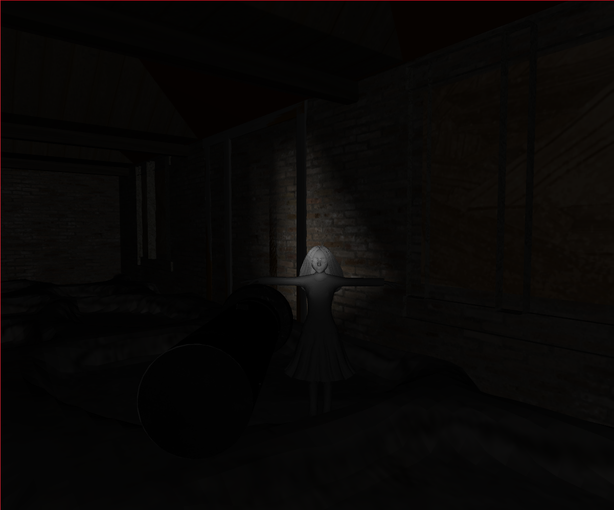

# Práctica 5 - Escena de elección personal


## Memoria

### Autor

Kevin David Rosales Santana - <kevin.rosales101@alu.ulpgc.es>

### Índice

1. [Introducción](#1-introducción)
2. [Muestra del resultado](#2-muestra-del-resultado)
3. [Descripción del trabajo realizado](#3-descripción-del-trabajo-realizado)

   3.1 [Estructura de ficheros](#31-estructura-de-ficheros)
   
   3.2 [Decisiones en el desarrollo](#32-decisiones-en-el-desarrollo)
   
      - 3.2.1 [QueasyCam](#321-queasycam)
      - 3.2.2 [Modelos y texturas](#322-modelos-y-texturas)
      - 3.2.3 [Iluminación y sonido](#323-iluminación-y-sonido)
      - 3.2.4 [Cambio entre menú y escena](#324-cambio-entre-menú-y-escena)
      - 3.2.5 [Límites en el movimiento](#325-límites-en-el-movimiento)
   
4. [Conclusión](#4-conclusión)
5. [Ejecución del Proyecto](#5-ejecución-del-proyecto)
6. [Referencias y herramientas utilizadas](#6-referencias-y-herramientas-utilizadas)

### 1. Introducción

En la presente práctica se pedía implementar una escena de elección personal, sirviendo para el aprendizaje de *Processing*, el cual tiene como objetivo facilitar los desarrollos con fines creativos en entornos digitales. 

En este repositorio **se tiene la implementación de la escena pedida ambientada en terror**, que incluye:

- Movimiento de cámara en primera persona usando la biblioteca de [QueasyCam](#321-queasycam)
- Uso de [modelos 3D y texturas](#322-modelos-y-texturas)
- Uso de distintos tipos de [iluminación y sonido](#323-iluminación-y-sonido)
- Cambio entre [menú para la información de controles y escena](#324-cambio-entre-menú-y-escena)
- [Límites en el movimiento](#325-límites-en-el-movimiento) para evitar que el usuario salga del escenario

La escena en sí consiste en el usuario dentro de una cabaña oscura que, mientras camina por dicha estancia con una linterna, le suceden tres eventos distintos repetidamente:

- Probable: Escucha a una niña riéndose para a continuación aparecer dicha niña en medio de la habitación en un lugar aleatorio y desaparecer hasta la siguiente risa (ver [*Figura 1*](#2-muestra-del-resultado)).
- Poco probable: La linterna se le queda sin pilas momentáneamente y comienza a parpadear hasta que consigue volver a tener energía (ver [*Figura 1*](#2-muestra-del-resultado)).
- Muy poco probable: Escucha un sonido siniestro.

### 2. Muestra del resultado

<div align="center">
   </img>
   <p>Figura 1: Muestra del resultado</p>
</div>

### 3. Descripción del trabajo realizado

#### 3.1 Estructura de ficheros

Para realizar este trabajo, se han creado estos dos ficheros (presentes en la carpeta [Practica5](Practica5/)):

| Fichero          | Descripción                                                  |
| :--------------- | :----------------------------------------------------------- |
| *Practica5.pde*  | Fichero encargado de la **interfaz gráfica** del escenario. Además, al ser el fichero principal, gestiona el `setup()` y el `draw()` del proyecto haciendo uso del controlador de este. Es el encargado de cambiar  [entre menú y escena](#324-cambio-entre-menú-y-escena). Además, se encarga de generar la habitación, la linterna y la niña mediante [modelos y texturas](#322-modelos-y-texturas). Por último, se encarga de escuchar los eventos de teclado y ratón. |
| *Controller.pde* | Clase **controlador**. Administra la lógica de la cámara proporcionada por [QueasyCam](#321-queasycam). Se encarga además de gestionar la [iluminación y sonido](#323-iluminación-y-sonido) y de gestionar los eventos aleatorios mencionados en la [introducción](#1-introducción). También se asegura de [gestionar límites](#325-límites-en-el-movimiento) para que el usuario no salga de la cabaña. |

<div align="center">
   <p>Tabla 1: Estructura de ficheros</p>
</div>

#### 3.2 Decisiones en el desarrollo

A la hora de realizar la escena de terror se ha tenido que tomar una serie de decisiones respecto al desarrollo del proyecto. A continuación, se listarán dichas decisiones:

##### 3.2.1 QueasyCam

Para la implementación de la cámara se ha usado *QueasyCam* [(ver referencia 7)](#6-referencias-y-herramientas-utilizadas). A pesar de haber entrado en estado en estado inactivo precisamente la semana en la que se entrega este proyecto, me ha resultado una biblioteca muy útil ya que es capaz de abstraer las propiedades necesarias para que el programador se despreocupe de detalles menores de la cámara.

Por ejemplo, a la hora de ponerla en activo, solamente es necesario:

```java
Controller(Practica5 gui){
  cam = new QueasyCam(gui);
  cam.sensitivity = 0.4;
  cam.speed = 0.75;
  cam.pan = 1.56;
  cam.tilt = -0.52;
}
```

<div align="center">
   <p>Fragmento de código 1: Inicialización de la cámara</p>
</div>

Con esto conseguimos que el usuario pueda girar la cámara a una sensibilidad (`sensitivity`) o que pueda caminar a una velocidad en concreto (`speed`). Para ajustar a dónde va a mirar la cámara por primera vez se usa `pan` (vertical) y `tilt` (horizontal). Para que el usuario no pueda desplazarse por el eje y (vertical) y por tanto, pueda volar, tan solo se debe usar:

```java
[...]
cam.velocity.y = 0;
cam.position.y = 0;
[...]
```

<div align="center">
   <p>Fragmento de código 2: Ajuste de movimiento de la cámara en <i>QueasyCam</i></p>
</div>

A la hora de gestionar la posición, se usa `position` y a la hora de obtener el punto donde se está observando en un rango de [-1,1], `getForward()`. Estos elementos serán usados más adelante en la [iluminación](#323-iluminación-y-sonido).

##### 3.2.2 Modelos y Texturas

A la hora de comentar los modelos y texturas, se debe mencionar que los enlaces a los modelos concretos son los siguientes [(consultar la página en la referencia 5)](#6-referencias-y-herramientas-utilizadas):

- [Linterna](#6-referencias-y-herramientas-utilizadas)
- [Suelo](https://free3d.com/3d-model/cobblestones-2-41224.html)
- [Niña](https://free3d.com/3d-model/cartoon-girl-3d-model-978365.html)
- [Cabaña](https://free3d.com/3d-model/abandoned-cottage-35276.html)

En algunos casos, se tuvo que modificar algún fichero *.mtl* para configurar correctamente las texturas de dichos modelos tridimensionales.

La carga de dichos modelos es bastante similar:

```java
void setRoom(){
  room = loadShape("models/room/abandoned_cottage.obj");
  floor = loadShape("models/floor/CobbleStones2.obj");
  room.scale(1);
  floor.scale(125);
}

[..]

void drawRoom(){
  pushMatrix();
  translate(0,100);
  rotateX(radians(180));
  shape(room);
  popMatrix();
  
  pushMatrix();
  translate(-100, 50);
  shape(floor);
  popMatrix();
}
```

<div align="center">
   <p>Fragmento de código 3: Carga de modelos con texturas en el proyecto</p>
</div>

Suele consistir en una carga, un escalado y a continuación, por cada `draw()`, un `translate(x,y[,z])`, uno o varios `rotate(degrees)` y por último un `shape(model)`.

Respecto a la linterna, es necesario realizar unas rotaciones algo más complejas a partir de la dirección y la posición de la cámara en ese momento.

```java

void drawFlashlight(){
  pushMatrix();
  PVector cameraPos = controller.getCamera().position;
  PVector cameraDir = controller.getCamera().getForward();
  translate(cameraPos.x+(10*cameraDir.x), cameraPos.y+3, cameraPos.z+(6*cameraDir.z));
  if (cameraDir.z < 0) rotateX(HALF_PI + cameraDir.y*HALF_PI);
  if (cameraDir.z >= 0) rotateX(HALF_PI - cameraDir.y*HALF_PI);
  if (cameraDir.x < 0) rotateZ(HALF_PI + atan(cameraDir.z/(cameraDir.x+0.00000001)));
  if (cameraDir.x >= 0) rotateZ(-HALF_PI + atan(cameraDir.z/(cameraDir.x+0.00000001)));
  shape(flashlight);
  popMatrix();
}
```

<div align="center">
   <p>Fragmento de código 4: Gestión de la linterna como modelo</p>
</div>

##### 3.2.3 Iluminación y sonido

Respecto a la iluminación, se han usado dos técnicas para este escenario:

- `pointLight(r,g,b,x,y,z)`: fija una luz con un cono de 180º, requiriendo únicamente su color y posición. Se usa para otorgar una luz inicial a la vista inicial al usuario (de otra manera se vería demasiado oscuro inicialmente. Se probaron otras técnicas de iluminación pero `pointLight(r,g,b,x,y,z)` dio mejores resultados).
- `spotLight(r,g,b,x,y,z,dx,dy,dz,angle,concentration)`: se utilizó para generar el efecto de linterna que se puede observar en la [*Figura 1*](#2-muestra-del-resultado).

```java
void updateLights(){
  PVector cameraPos = cam.position;
  PVector cameraDir = cam.getForward();
  if (flashlight >= 500 || (int)random(0,10) == 0) spotLight(255, 255, 255, cameraPos.x, cameraPos.y, cameraPos.z, cameraDir.x, cameraDir.y, cameraDir.z, PI/2, 500);
  pointLight(20, 20, 20, cameraPos.x, cameraPos.y, cameraPos.z);
  flashlight++;
}
```

<div align="center">
   <p>Fragmento de código 5: Implementación de técnicas de iluminación</p>
</div>

Se puede observar cómo la variable `flashlight` será la que defina si la linterna "tiene energía". El efecto de parpadeo del evento mencionado en [la introducción](#1-introducción). El efecto de parpadeo se logra gracias a la condición de `random` que se encuentra en la disyunción.

Se listan a continuación los audios concretos utilizados [(consultar la página en la referencia 4](#6-referencias-y-herramientas-utilizadas):

- [Electricidad de la linterna](https://freesound.org/people/Johnc/sounds/20681/)
- [Sonido siniestro](https://freesound.org/people/MrSoHot/sounds/242702/)
- [Risa de niña](https://freesound.org/people/alexkandrell/sounds/168417/)
- [Pie izquierdo](https://freesound.org/people/ice9ine/sounds/21692/)
- [Pie derecho](https://freesound.org/people/ice9ine/sounds/21695/)

Respecto a su ejecución, se siguen las indicaciones dadas en la [práctica 1](https://github.com/kevinrosalesdev/CIU-Practica1) con `thread`:

```java
void generateScarySounds(){
  if((int)random(0,1000) == 0){
    thread("sinisterChildLaughingEffect");
    childModelTranslateX = random(-480,467);
    childModelTranslateZ = random(-60,326);
    childModelRotateY = random(0,PI);
    childModel = 0;
  }else if ((int)random(0,3000) == 0){
    thread("scarySoundEffect");
  }else if ((int)random(0,1500) == 0){
    thread("electricityEffect");
    flashlight = 0;
  }  
}

[...]

void sinisterChildLaughingEffect(){
  sinisterChildLaughingEffect.play();  
}

void scarySoundEffect(){
  scarySoundEffect.play();  
}

void electricityEffect(){
  electricityEffect.play();
}
```

<div align="center">
   <p>Fragmento de código 6: Ejecución de sonido</p>
</div>

##### 3.2.4 Cambio entre menú y escena

Respecto al cambio entre el menú y la escena de terror, se ha utilizado una variable booleana `isMenu`. Cuando se pulsa la tecla `ENTER`, su valor cambia, cambiando a su vez la vista del usuario desde el menú hasta la escena y viceversa.

El menú otorga a su vez información sobre los controles a usar.

| Menú                              | Escena                              |
| --------------------------------- | ----------------------------------- |
|  |  |

<div align="center">
   <p>Tabla 1: Comparación entre menú/escena (uso de linterna)</p>
</div>

##### 3.2.5 Límites en el movimiento

Se controla que el usuario no salga de la escena usando `position` de la cámara de  *QueasyCam* [(ver referencia 7)](#6-referencias-y-herramientas-utilizadas).

```java
  void wallsConstraints(){
    if(cam.position.x >= 467) cam.position.x = 467;
    if(cam.position.x <= -480) cam.position.x = -480;
    if(cam.position.z >= 326) cam.position.z = 326;
    if(cam.position.z <= -60) cam.position.z = -60;
  }
```

<div align="center">
   <p>Fragmento de código 7: Límites en el movimiento de la cabaña</p>
</div>

### 4. Conclusión

Esta práctica ha servido una vez más como aprendizaje para *Processing* y, además, se ha tratado de una práctica muy entretenida donde se ha tenido contacto con una herramienta que sirve como herramienta para aprender el funcionamiento de las cámaras, de la iluminación y de los objetos en este tipo de programas informáticos.

*Processing* para ello otorga una serie de funciones muy útiles y con cometidos muy distintos que permiten realizar tareas tan variadas como la que se puede observar en este repositorio. La comunidad a su vez, ayuda a la programación en *processing* otorgando bibliotecas como *QueasyCam* [(ver referencia 7)](#6-referencias-y-herramientas-utilizadas).

Por último, se debe recalcar que gracias a esta quinta práctica de *Creando Interfaces de Usuario*, se ha podido aprender mucho más el funcionamiento de los objetos tridimensionales y de los elementos que los envuelven.

### 5. Ejecución del proyecto

Para ejecutar este proyecto, es necesario:

- Tener instalado [Processing (Referencia 3)](#6-referencias-y-herramientas-utilizadas)
- Tener instalado [*QueasyCam* (ver referencia 7)](#6-referencias-y-herramientas-utilizadas).
- Haber instalado la librería *Sound*, de *The Processing Foundation* [(ver página 39 de la Referencia 1)](#6-referencias-y-herramientas-utilizadas).

Para ejecutar el proyecto, tan solo se debe abrir el fichero [Practica5.pde](Practica5/Practica5.pde) y darle al botón de ejecutar.

**Nota importante:** es posible que debido a la cantidad objetos en un espacio tridimensional la carga inicial sea algo elevada (en torno a los 10 segundos en mi caso).

### 6. Referencias y herramientas utilizadas

- [1] Modesto Fernando Castrillón Santana, José Daniel Hernández Sosa. [Creando Interfaces de Usuario. Guion de Prácticas](https://cv-aep.ulpgc.es/cv/ulpgctp20/pluginfile.php/126724/mod_resource/content/25/CIU_Pr_cticas.pdf)
- [2] Processing Foundation. [Processing Reference.](https://processing.org/reference/)
- [3] Processing Foundation. [Processing Download.](https://processing.org/download/)
- [4] Extrapixel. [GifAnimation Processing Library.](https://github.com/extrapixel/gif-animation)
- [5] TurboSquid, Inc. [Free3D.](https://free3d.com/)
- [6] Universitat Pompeu Fabra. [Freesound.](https://freesound.org/)
- [7] Josh Castle. [QueasyCam.](https://github.com/jrc03c/queasycam)
